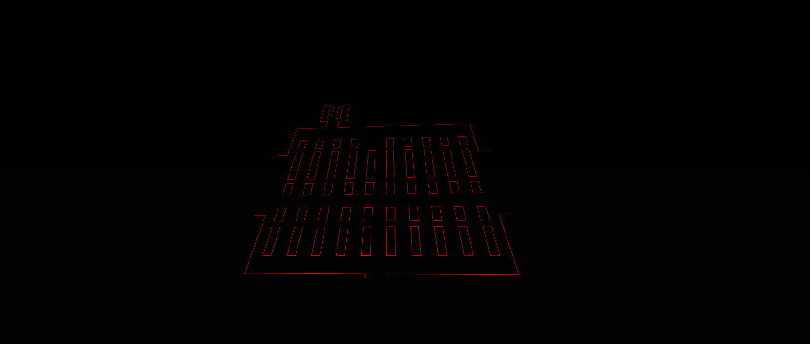

# 🌟 Digital Twin Project: Real-Time Data Dashboard with Omniverse USD Integration

🚀 **Welcome to the Digital Twin Project!**  
This project focuses on creating a real-time data dashboard integrated with NVIDIA Omniverse's Universal Scene Description (USD) files. It showcases how digital twin technology can optimize processes in industries like manufacturing and smart building management.

---

## 📽️ **Understanding Digital Twin**

### **Overview**
A digital twin is a virtual replica of a real-world system, enabling better management, monitoring, and optimization through real-time data integration.

### **Applications**
- **Manufacturing Industry:**
  - Monitoring 64 assets with detailed data such as operational status and points of contact.
  - Real-time alerts for operations and long-term analytics for process improvement.
  - Integration with existing databases to optimize workflows.
- **Smart Buildings:**
  - Real-time energy tracking (HVAC, lighting) and maintenance alerts.
  - Bottleneck identification and optimization to reduce energy consumption and downtime.
  - Predictive maintenance, cost tracking, and equipment downtime analysis.

### **Key Takeaways**
- **Monitor:** Real-time tracking and alerts.
- **Analyze:** Data-driven strategies for optimization.
- **Optimize:** Energy savings, maintenance scheduling, and efficiency improvements.
- **Feedback Loop:** Continuous improvement by integrating insights back into the system.

---

## 🛠️ **Tech Stack**

### **Chosen Stack**
- **Frontend:** React.js (efficient component-based UI development).
- **Backend:** Node.js + Express (scalable and real-time API support).
- **Visualization:** NVIDIA Omniverse USD (seamless 3D model integration).
- **Scripting:** Python (for Omniverse automation and data handling).

### **Best Alternatives**
- **Frontend:** Angular, Vue.js.
- **Backend:** Django (Python), Spring Boot (Java).
- **Visualization:** Unity, Unreal Engine (for advanced 3D rendering).
- **Scripting:** Rust (for high-performance computation).

### **Mobile App Tech Stack**
- **Frontend:** React Native, Flutter.
- **Backend:** Firebase, AWS Amplify.
- **Visualization:** WebGL for lightweight 3D model rendering.

---

## 📂 **Folder Structure**

```
digital-twin/
├── omniverse/              # Python for Omniverse
│   ├── src/
│   │   ├── app.py               # Main application script
│   │   ├── twin_visualization.py # Handles loading USD models
│   │   ├── data_simulator.py    # Simulates real-time data
│   │   ├── ui.py                # Omniverse UI components
│   ├── templates/               # USD models for the digital twin
│   │   ├── factory.usda         # Industrial layout (from models pack)
│   │   ├── machines.usda        # Machine components
│   │   ├── warehouse.usda       # Warehouse/tower components
│   ├── requirements.txt         # Python dependencies
├── server/                 # Node.js Backend
│   ├── app.js                  # Node.js server
│   ├── routes/
│   │   ├── data.js             # Routes for real-time data API
│   ├── package.json            # Node.js dependencies
│   └── utils/
│       ├── omniverse.js        # Integrates with Omniverse Python scripts
├── client/                 # React Frontend
│   ├── public/                 # Static files
│   ├── src/
│   │   ├── App.js              # React entry point
│   │   ├── components/         # Reusable React components
│   │   │   ├── Dashboard.js    # Main dashboard for digital twin
│   │   ├── utils/
│   │   │   ├── api.js          # API calls to Node.js server
│   ├── package.json            # React dependencies
└── README.md                # Documentation
```

---

## 📸 **Images and Visuals**

Here are the key screenshots showcasing the project:

1. **Omniverse USD Files:** Factory layouts, machine components, and 3D models.  
   


2. **3D Model Placement:** Objects placed at various locations using Omniverse.  
   ``

3. **Omniverse Connection:** Localhost integration with server.  
   ``

4. **Real-Time Dashboard:** Real-time data visualization and USD model integration.  
   ``

5. **Code Screenshots:** Omniverse scripts and React components.  
   ``

6. **Maintenance Workflow:** Alerts, tickets, and predictive maintenance setup.  
   ``

7. **Energy Monitoring:** HVAC and lighting system tracking in a smart building.  
   ``

8. **Analytics Panel:** Long-term trends and bottleneck identification.  
   ``

---

## 🚧 **Current Status**
- Testing **Omniverse USD** integration for enhanced digital twin capabilities.
- Dashboard connection to real-time data and USD model replica in progress.

---

## 🔄 **Future Updates**
- Full integration of USD files with real-time data visualization.
- Updates to digital twin framework for sustainable building management.

---

Let me know if you have additional requirements or need further clarification!
